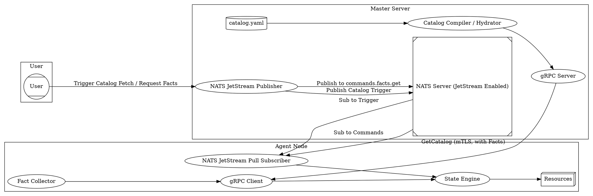

# Praetor - Configuration Management & Orchestration

Praetor is a lightweight configuration management and orchestration system
inspired by Puppet and Choria, built in Golang, using NATS JetStream for
real-time messaging and gRPC for secure Master-Agent communication.

## Why "Praetor"?

In ancient Rome, a Praetor was a magistrate with significant authority, often
with military command and the power to enact laws and judgments. This system
aims to provide similar precise control and command over your infrastructure,
ensuring systems adhere to their intended state and allowing for swift, decisive
actions.

## Architecture

The system uses a hybrid model, maintaining a pull-based security posture:

*   **Configuration Plane (NATS Triggered gRPC Pull):** The Master triggers
    agents to fetch their catalog by sending a message via NATS JetStream to a
    node-specific subject (e.g., `agent.trigger.getCatalog.agent1`). Upon
    receiving the trigger, the Agent initiates a gRPC call (secured with mTLS) to
    the Master to get its catalog. Agents send system facts along with the
    request. The catalog is compiled by the Master, hydrated with agent facts
    using Go templates, cryptographically signed, and verified by the Agent.
*   **Orchestration Plane (Agent-Initiated Pull Subscription to NATS
    JetStream):** Agents establish a persistent, mTLS secured connection to NATS
    JetStream and use *pull-based subscriptions* to listen for ad-hoc commands
    on subjects under `commands.>`. Currently, only `commands.facts.get` is
    implemented.



**Components:**

*   **Master:** Manages configurations, receives agent facts, compiles and signs
    catalogs, and publishes catalog update triggers (default every 15s) to NATS
    JetStream.
*   **Agent:** Runs on managed nodes, collects facts, listens for NATS triggers to
    fetch catalogs via gRPC, enforces state, and listens for ad-hoc commands (like
    `commands.facts.get`) via a NATS JetStream pull subscription.
*   **NATS:** Message broker with JetStream enabled for persistent and reliable
    real-time command and control, and triggering.

## Setup

1.  **Prerequisites:** Docker, Docker Compose, Go, OpenSSL, NATS CLI, protoc.

2.  **Generate Certificates (Auto-TLS):**

    Praetor now handles PKI out-of-the-box! You do not need to manage certificates manually.
    When `praetor-master` boots, if it detects a missing `master/certs/ca.crt`, it will **automatically** generate the entire unified CA, NATS server keys, and Master signing credentials cross-platform.


3.  **Generate Proto Code:** If you modify `proto/master.proto`, regenerate the
    Go code:

    ```bash
    cd proto
    go mod tidy
    cd ..
    protoc --go_out=./proto/gen/master --go-grpc_out=./proto/gen/master proto/master.proto --go_opt=module=github.com/guilledipa/praetor/proto/gen/master --go-grpc_opt=module=github.com/guilledipa/praetor/proto/gen/master
    cd proto/gen/master
    go mod tidy
    cd ../../..
    ```

4.  **Start NATS Server (with JetStream):**

    ```bash
    docker compose down -v
    docker compose build nats
    docker compose up -d nats
    ```

    The configuration in `nats/conf/nats-server.conf` and `docker-compose.yml`
    enables JetStream with persistent storage.

5.  **Start Master:**

    ```bash
    cd master
    # Optional: Configure NATS connection and trigger interval
    # export MASTER_NATS_URL=nats://custom:4222
    # export MASTER_TRIGGER_INTERVAL=30s
    go run cmd/master/main.go
    ```

6.  **Start Agent:**

    ```bash
    cd agent
    go run cmd/agent/main.go
    ```

## Core Resources

Praetor ships with a core set of native Linux resources needed to deploy most applications out-of-the-box. These are compiled directly into the agent for maximum performance and reliability on base Linux distributions:

*   **File:** Manage file contents, existence, permissions, and owners. 
*   **Package:** Manage OS packages using an intelligent, pluggable provider that detects `apt`, `yum`, or `apk` automatically.
*   **Service:** Control system daemon states (`running`, `stopped`, `enable` or `disable`) with native `systemd` support and a `service` fallback.
*   **Exec:** Execute arbitrary shell commands, with built-in idempotency logic (`creates`, `onlyif`, `unless`).
*   **User:** Manage deep configuration of Linux user accounts, mapping primary/secondary groups, homes, shells, and structural UIDs natively via `useradd`/`usermod`.
*   **Group:** Establish and enforce structural groups directly against `/etc/group` binaries (`groupadd`/`groupmod`).
*   **Cron:** Isolate, inject, and enforce scheduled cron jobs identically inside a user's `crontab -l` isolated via explicit UUID tagging, protecting manual job edits.

## Catalog Schema & Hydration

Catalogs now follow a defined schema using Go structs located in the `schema/`
directory. Resources within the catalog are validated against
these schemas on the agent side.

The Master **hydrates** the catalog content based on agent facts. String fields
within the resource `spec` in `master/catalog.yaml` can contain Go
`text/template` syntax (e.g., `{{ .facts.hostname }}`). The Master renders these
templates before sending the catalog to the agent.

Example `master/catalog.yaml` resource:

```yaml
apiVersion: praetor.io/v1alpha1
kind: Catalog
metadata:
  name: default-catalog
spec:
  resources:
    - apiVersion: praetor.io/v1alpha1
      kind: File
      metadata:
        name: managed-by-master
      spec:
        path: /tmp/managed_by_master.txt
        content: "This file is managed by the MASTER (v4).\nHostname: {{ .facts.hostname }}\nOS: {{ .facts.os }}"
        ensure: present
        mode: "0644"
    - apiVersion: praetor.io/v1alpha1
      kind: File
      metadata:
        name: to-be-deleted
      spec:
        path: /tmp/to_be_deleted.txt
        ensure: absent
```

## Usage

### Catalog Management

Modify `master/catalog.yaml` to define the desired state. The Master will
periodically (every `MASTER_TRIGGER_INTERVAL`, default 15s) send a trigger to the
`TARGET_NODE_ID` (default `agent1`) to fetch and apply the catalog.

To manually trigger an update on `agent1` outside the interval:

```bash
nats --tlscert ./nats/certs/client.crt --tlskey ./nats/certs/client.key --tlsca ./nats/certs/ca.crt --server=nats://localhost:4222 pub agent.trigger.getCatalog.agent1 ""
```

### NATS Commands

Currently, the only ad-hoc command supported is `commands.facts.get`.

Example: Get facts from `agent1`:

```bash
nats --tlscert ./nats/certs/client.crt --tlskey ./nats/certs/client.key --tlsca ./nats/certs/ca.crt --server=nats://localhost:4222 req commands.facts.get '{"facts": ["os", "hostname"]}'
```

### Observability / Metrics

The Master node natively exposes an OpenMetrics / Prometheus `/metrics` endpoint on port `8080`.
You can bind Prometheus or Datadog scrapers to monitor the fleet's orchestration health directly!
```bash
curl http://localhost:8080/metrics
```

## Key Concepts

*   **mTLS:** Mutual Transport Layer Security is used to secure all gRPC
    communication between the Master and Agent, and also for connections to the
    NATS server.
*   **NATS JetStream:** The persistence layer of NATS, used for the
    Orchestration Plane and for triggering catalog fetches.
*   **Fact Management:** Agents collect system facts (e.g., OS, hostname, CPU, memory
    via `gopsutil`) and send them to the Master with each catalog request. The
    Master can use these facts to tailor catalog compilation. This is extensible
    through the `facts.Facter` interface.
*   **Catalog:** A document (currently generated from `master/catalog.yaml`)
    conforming to the defined schemas in `schema/` that defines the desired
    state of resources on a node. The content is hydrated by the Master using
    agent facts.
*   **Digital Signatures:** The Master cryptographically signs the catalog using
    ED25519, and the Agent verifies the signature to ensure authenticity and
    integrity.
*   **Resources:** Abstract representations of configurable items on a node
    (e.g., files, packages, services). Each resource type has a defined schema
    and implements the `resources.Resource` interface.

## Project Structure

Praetor follows a modular go workspace approach:

*   **`agent/`**: Contains the agent application, including its `main.go` entrypoint, local `facts/` collectors, and the enforcement logic for `resources/`.
*   **`master/`**: Contains the master application, `main.go` entrypoint, and the `catalog/` compilation logic.
*   **`pkg/`**: Core shared libraries that are agnostic to the specific binary running them. 
    *   Currently houses the `broker/` package for pluggable messaging (e.g., NATS). 
    *   Future shared utilities (like logging, TLS helpers, or auth libraries) should be placed here.
*   **`schema/`**: Shared structs and validation logic for the configuration catalog to ensure both Master and Agent agree on resource definitions.
*   **`proto/`**: gRPC interface definitions and the resulting generated code.

## Developing New Fact Providers

To add a new source of custom facts:

1.  **Create a Package:** Create a new directory under `agent/facts/` (e.g.,
    `agent/facts/myfacts`).

2.  **Define the Struct:** Inside your new package, define a struct for your custom
    facter.

3.  **Implement `facts.Facter` Interface:** Implement the following methods for
    your struct:

    *   `Name() string`: Return a unique name for your facter (e.g.,
        `"myfacts"`).
    *   `GetFacts() (map[string]interface{}, error)`: Return a map of fact names
        to their values. This is where you'll implement the logic to gather
        your custom facts.

4.  **Register the Facter:** In the same file, add an `init()` function to
    register your new facter with the central fact registry:

    ```go
    package myfacts

    import (
        "github.com/guilledipa/praetor/agent/facts"
    )

    type MyFacter struct{}

    func (f *MyFacter) Name() string { return "myfacts" }

    func (f *MyFacter) GetFacts() (map[string]interface{}, error) {
        myFcts := make(map[string]interface{})
        // ... gather custom facts ...
        myFcts["my_custom_fact"] = "some_value"
        return myFcts, nil
    }

    func init() {
        facts.RegisterFacter(&MyFacter{})
    }
    ```

5.  **Import in Agent:** Add a blank import to `agent/main.go` to ensure the
    `init()` function of your new facter package is executed:

    ```go
    import (
        // ... other imports
        _ "github.com/guilledipa/praetor/agent/facts/myfacts"
    )
    ```

6.  **Update `agent/go.mod`:** Run `go mod tidy` in the `agent` directory.

## Developing New Resources

To add support for a new resource type (e.g., `crontab`):

1.  **Create Schema:** Define the struct for your resource in the `schema/`
    directory (e.g., `schema/package.go`), including `APIVersion`, `Kind`,
    `ObjectMeta`, and `Spec` with validation tags.

2.  **Create Resource Package:** Create a new directory under `agent/resources/`
    (e.g., `agent/resources/package`).

3.  **Implement `resources.Resource` Interface:** In your new package, create a
    struct that embeds the schema struct. Implement the methods:
    *   `Type() string`: Return `Kind` from the schema.
    *   `ID() string`: Return a unique identifier (e.g., from `Metadata.Name`).
    *   `Get() (resources.State, error)`: Retrieve the current state.
    *   `Test(currentState resources.State) (bool, error)`: Compare current vs
        desired.
    *   `Set() error`: Enforce the desired state.

4.  **Register the Type:** Add an `init()` function to register your new type using
    `resources.RegisterType`, unmarshalling into your schema struct and
    validating it.

    ```go
    package myresource

    import (
        "encoding/json"
        "fmt"
        "github.com/guilledipa/praetor/agent/resources"
        "github.com/guilledipa/praetor/schema"
        "github.com/go-playground/validator/v10"
    )

    type MyResource struct {
        schema.MyResource // Embed the schema definition
    }

    func init() {
        resources.RegisterType("MyResourceKind", func(spec json.RawMessage) (resources.Resource, error) {
            var r schema.MyResource
            if err := json.Unmarshal(spec, &r); err != nil {
                return nil, fmt.Errorf("failed to unmarshal myresource spec: %w", err)
            }
            if err := r.Validate(); err != nil {
                return nil, fmt.Errorf("myresource spec validation failed: %w", err)
            }
            return &MyResource{MyResource: r}, nil
        })
    }

    // ... Implement resources.Resource interface for &MyResource ...
    ```

#### 6. Update `agent/go.mod`
Run `go mod tidy` or preferably use `make tidy` at the project root.

## Local Development (Build System)

Praetor uses a natively managed **Go Workspace** (`go.work`) linked with a root **Makefile** to orchestrate its multi-module architecture effortlessly.

Using `go.work` enables IDEs (like VSCode or GoLand) to instantly resolve cross-module imports (e.g., when the `agent` heavily references the `pkg` module).

You do not need to individually compile components. The project root provides a unified Make Task Runner:

- **`make all`**: Compiles Protobufs, executes all tests, and builds binaries.
- **`make build`**: Statically compiles both the `agent` and `master` binaries sequentially and exports them into `./bin/`.
- **`make test`**: Runs the entire matrix of table-driven testing suites simultaneously across `agent/`, `master/`, and `pkg/`.
- **`make tidy`**: Globally cleans up dependency trees on all 4 isolated `go.mod` files.

#### Proto Generation

If you modify `proto/master.proto`, you need to regenerate the Go code using `protoc` across the workspace. We have completely automated this via the root `Makefile`. 

Simply run:
```bash
make proto
make tidy
```
This single command handles compiling the gRPC abstractions and cleanly restructuring all 4 module dependency trees automatically!

## Phase 8 Capabilities Built

- **Persistent State Compliance Reports**: Expand the `ReportState` handler on the Master to implement a `StorageProvider` (NATS JetStream Key/Value) that persistently caches the historical configuration drifts generated across the fleet, paving the way for a compliance dashboard.
- **Multi-OS Package Manager Support**: Expand the `Package` resource plugin on the agent to dynamically swap `apt` out for `yum`, `dnf`, or `zypper` depending on the enforcing node's `$PATH` binary availability.
- **Advanced Linux Primitives**: We fully established robust state management over structural Linux boundaries including `user`, `group`, and `cron` components, verified safely under the hood through Go Helper Process mocking abstractions.

## Phase 17 Capabilities Built: Extensible RPC Plugin Engine

While Praetor previously compiled its "Core" Linux plugins directly into the agent binary, we have decoupled extensibility entirely using a **Hashicorp-style RPC Plugin Architecture**.

### The "Core" Plugin vs "External" Plugins
- **The Core Linux Plugin**: The local Linux resources (File, User, Group, Service, Package, Cron, Exec) were successfully extracted into a primary `praetor-plugin-linux` standalone provider. 
- **Ecosystem Expansion**: End users can now write completely isolated plugins in *any programming language* (Go, Python, Rust) without recompiling Praetor! Drop a plugin binary into the `/opt/praetor/plugins/` directory, and the Agent daemon auto-discovers and orchestrates them dynamically over `gRPC`.


### How RPC Plugins Work
When Praetor encounters a `mysql_user` resource or any dynamic primitive in its declarative DAG, it doesn't execute it internally:
1. Praetor daemon spins up the target `praetor-plugin-` binary in the background.
2. The Agent handshakes with the binary over a local UNIX Domain Socket (UDS) proxy via robust **gRPC**.
3. It dispatches a `GetState(resource_id)` RPC call.
4. The plugin securely returns the state evaluation, and Praetor schedules the drifts mathematically. If the plugin crashes, Praetor simply catches the RPC termination and flags the resource as failed without bringing down the orchestrator!

### Physical Host & VM Deployment Architecture
Because plugins operate via isolated binaries communicating over gRPC UNIX Sockets, they act cleanly across typical physical machines or Virtual Machines (VMs) where the primary Praetor Agent is running.

Plugins do not need to be compiled directly into the monolithic Agent installation. 
Instead, they deploy smoothly onto the host OS:
- **Daemon Native Spawning:** You place a standalone `praetor-plugin-mysql` binary in a known directory (e.g., `/opt/praetor/plugins/`). When the primary `praetor-agent` (running as a `systemd` service) boots up, it discovers these binaries and launches them natively as child background daemons. 
- **Isolated UNIX Sockets:** The agent and its child plugins communicate locally over `/var/run/praetor/` UNIX sockets securely on the host machine.
- **Resilience:** If a specific workload plugin (like `mysql` or `redis`) panics or crashes, the core OS node agent remains completely stable and simply flags the associated resources as unreachable, continuing to manage everything else!
