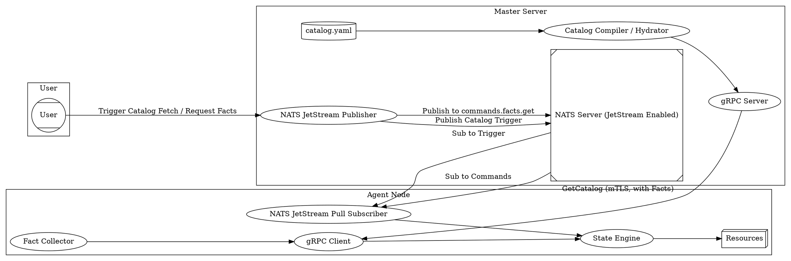

# Praetor - Configuration Management & Orchestration

Praetor is a lightweight configuration management and orchestration system
inspired by Puppet and Choria, built in Golang, using NATS JetStream for
real-time messaging and gRPC for secure Master-Agent communication.

## Why "Praetor"?

In ancient Rome, a Praetor was a magistrate with significant authority, often
with military command and the power to enact laws and judgments. This system
aims to provide similar precise control and command over your infrastructure,
ensuring systems adhere to their intended state and allowing for swift, decisive
actions.

## Architecture

The system uses a hybrid model, maintaining a pull-based security posture:

*   **Configuration Plane (NATS Triggered gRPC Pull):** The Master triggers
    agents to fetch their catalog by sending a message via NATS JetStream to a
    node-specific subject (e.g., `agent.trigger.getCatalog.agent1`). Upon
    receiving the trigger, the Agent initiates a gRPC call (secured with mTLS) to
    the Master to get its catalog. Agents send system facts along with the
    request. The catalog is compiled by the Master, hydrated with agent facts
    using Go templates, cryptographically signed, and verified by the Agent.
*   **Orchestration Plane (Agent-Initiated Pull Subscription to NATS
    JetStream):** Agents establish a persistent, mTLS secured connection to NATS
    JetStream and use *pull-based subscriptions* to listen for ad-hoc commands
    on subjects under `commands.>`. Currently, only `commands.facts.get` is
    implemented.



**Components:**

*   **Master:** Manages configurations, receives agent facts, compiles and signs
    catalogs, and publishes catalog update triggers (default every 15s) to NATS
    JetStream.
*   **Agent:** Runs on managed nodes, collects facts, listens for NATS triggers to
    fetch catalogs via gRPC, enforces state, and listens for ad-hoc commands (like
    `commands.facts.get`) via a NATS JetStream pull subscription.
*   **NATS:** Message broker with JetStream enabled for persistent and reliable
    real-time command and control, and triggering.

## Setup

1.  **Prerequisites:** Docker, Docker Compose, Go, OpenSSL, NATS CLI, protoc.

2.  **Generate Certificates:**

    ```bash
    ./generate_certs.sh
    ./generate_signing_keys.sh
    ```

    This creates certificates for NATS, Master gRPC, Agent gRPC client, and keys
    for catalog signing.

3.  **Generate Proto Code:** If you modify `proto/master.proto`, regenerate the
    Go code:

    ```bash
    cd proto
    go mod tidy
    cd ..
    protoc --go_out=./proto/gen/master --go-grpc_out=./proto/gen/master proto/master.proto --go_opt=module=github.com/guilledipa/praetor/proto/gen/master --go-grpc_opt=module=github.com/guilledipa/praetor/proto/gen/master
    cd proto/gen/master
    go mod tidy
    cd ../../..
    ```

4.  **Start NATS Server (with JetStream):**

    ```bash
    docker compose down -v
    docker compose build nats
    docker compose up -d nats
    ```

    The configuration in `nats/conf/nats-server.conf` and `docker-compose.yml`
    enables JetStream with persistent storage.

5.  **Start Master Server:**

    ```bash
    cd master
    # Optional: Configure NATS connection and trigger interval
    # export MASTER_NATS_URL=nats://custom:4222
    # export MASTER_TRIGGER_INTERVAL=30s
    go mod tidy
    go run main.go
    ```

6.  **Start Agent:**

    ```bash
    cd agent
    go mod tidy
    go run main.go
    ```

## Core Resources

Praetor ships with a core set of resources needed to deploy most applications out-of-the-box:

*   **File:** Manage file contents, existence, permissions, and owners. 
*   **Package:** Manage OS packages using an intelligent, pluggable provider that detects `apt`, `yum`, or `apk` automatically.
*   **Service:** Control system daemon states (`running`, `stopped`, `enable` or `disable`) with native `systemd` support and a `service` fallback.
*   **Exec:** Execute arbitrary shell commands, with built-in idempotency logic (`creates`, `onlyif`, `unless`).

## Catalog Schema & Hydration

Catalogs now follow a defined schema using Go structs located in the `schema/`
directory. Resources within the catalog are validated against
these schemas on the agent side.

The Master **hydrates** the catalog content based on agent facts. String fields
within the resource `spec` in `master/catalog.yaml` can contain Go
`text/template` syntax (e.g., `{{ .facts.hostname }}`). The Master renders these
templates before sending the catalog to the agent.

Example `master/catalog.yaml` resource:

```yaml
apiVersion: praetor.io/v1alpha1
kind: Catalog
metadata:
  name: default-catalog
spec:
  resources:
    - apiVersion: praetor.io/v1alpha1
      kind: File
      metadata:
        name: managed-by-master
      spec:
        path: /tmp/managed_by_master.txt
        content: "This file is managed by the MASTER (v4).\nHostname: {{ .facts.hostname }}\nOS: {{ .facts.os }}"
        ensure: present
        mode: "0644"
    - apiVersion: praetor.io/v1alpha1
      kind: File
      metadata:
        name: to-be-deleted
      spec:
        path: /tmp/to_be_deleted.txt
        ensure: absent
```

## Usage

### Catalog Management

Modify `master/catalog.yaml` to define the desired state. The Master will
periodically (every `MASTER_TRIGGER_INTERVAL`, default 15s) send a trigger to the
`TARGET_NODE_ID` (default `agent1`) to fetch and apply the catalog.

To manually trigger an update on `agent1` outside the interval:

```bash
nats --tlscert ./nats/certs/client.crt --tlskey ./nats/certs/client.key --tlsca ./nats/certs/ca.crt --server=nats://localhost:4222 pub agent.trigger.getCatalog.agent1 ""
```

### NATS Commands

Currently, the only ad-hoc command supported is `commands.facts.get`.

Example: Get facts from `agent1`:

```bash
nats --tlscert ./nats/certs/client.crt --tlskey ./nats/certs/client.key --tlsca ./nats/certs/ca.crt --server=nats://localhost:4222 req commands.facts.get '{"facts": ["os", "hostname"]}'
```

## Key Concepts

*   **mTLS:** Mutual Transport Layer Security is used to secure all gRPC
    communication between the Master and Agent, and also for connections to the
    NATS server.
*   **NATS JetStream:** The persistence layer of NATS, used for the
    Orchestration Plane and for triggering catalog fetches.
*   **Fact Management:** Agents collect system facts (e.g., OS, hostname, CPU, memory
    via `gopsutil`) and send them to the Master with each catalog request. The
    Master can use these facts to tailor catalog compilation. This is extensible
    through the `facts.Facter` interface.
*   **Catalog:** A document (currently generated from `master/catalog.yaml`)
    conforming to the defined schemas in `schema/` that defines the desired
    state of resources on a node. The content is hydrated by the Master using
    agent facts.
*   **Digital Signatures:** The Master cryptographically signs the catalog using
    ED25519, and the Agent verifies the signature to ensure authenticity and
    integrity.
*   **Resources:** Abstract representations of configurable items on a node
    (e.g., files, packages, services). Each resource type has a defined schema
    and implements the `resources.Resource` interface.

## Developing New Fact Providers

To add a new source of custom facts:

1.  **Create a Package:** Create a new directory under `agent/facts/` (e.g.,
    `agent/facts/myfacts`).

2.  **Define the Struct:** Inside your new package, define a struct for your custom
    facter.

3.  **Implement `facts.Facter` Interface:** Implement the following methods for
    your struct:

    *   `Name() string`: Return a unique name for your facter (e.g.,
        `"myfacts"`).
    *   `GetFacts() (map[string]interface{}, error)`: Return a map of fact names
        to their values. This is where you'll implement the logic to gather
        your custom facts.

4.  **Register the Facter:** In the same file, add an `init()` function to
    register your new facter with the central fact registry:

    ```go
    package myfacts

    import (
        "github.com/guilledipa/praetor/agent/facts"
    )

    type MyFacter struct{}

    func (f *MyFacter) Name() string { return "myfacts" }

    func (f *MyFacter) GetFacts() (map[string]interface{}, error) {
        myFcts := make(map[string]interface{})
        // ... gather custom facts ...
        myFcts["my_custom_fact"] = "some_value"
        return myFcts, nil
    }

    func init() {
        facts.RegisterFacter(&MyFacter{})
    }
    ```

5.  **Import in Agent:** Add a blank import to `agent/main.go` to ensure the
    `init()` function of your new facter package is executed:

    ```go
    import (
        // ... other imports
        _ "github.com/guilledipa/praetor/agent/facts/myfacts"
    )
    ```

6.  **Update `agent/go.mod`:** Run `go mod tidy` in the `agent` directory.

## Developing New Resources

To add support for a new resource type (e.g., `crontab`):

1.  **Create Schema:** Define the struct for your resource in the `schema/`
    directory (e.g., `schema/package.go`), including `APIVersion`, `Kind`,
    `ObjectMeta`, and `Spec` with validation tags.

2.  **Create Resource Package:** Create a new directory under `agent/resources/`
    (e.g., `agent/resources/package`).

3.  **Implement `resources.Resource` Interface:** In your new package, create a
    struct that embeds the schema struct. Implement the methods:
    *   `Type() string`: Return `Kind` from the schema.
    *   `ID() string`: Return a unique identifier (e.g., from `Metadata.Name`).
    *   `Get() (resources.State, error)`: Retrieve the current state.
    *   `Test(currentState resources.State) (bool, error)`: Compare current vs
        desired.
    *   `Set() error`: Enforce the desired state.

4.  **Register the Type:** Add an `init()` function to register your new type using
    `resources.RegisterType`, unmarshalling into your schema struct and
    validating it.

    ```go
    package myresource

    import (
        "encoding/json"
        "fmt"
        "github.com/guilledipa/praetor/agent/resources"
        "github.com/guilledipa/praetor/schema"
        "github.com/go-playground/validator/v10"
    )

    type MyResource struct {
        schema.MyResource // Embed the schema definition
    }

    func init() {
        resources.RegisterType("MyResourceKind", func(spec json.RawMessage) (resources.Resource, error) {
            var r schema.MyResource
            if err := json.Unmarshal(spec, &r); err != nil {
                return nil, fmt.Errorf("failed to unmarshal myresource spec: %w", err)
            }
            if err := r.Validate(); err != nil {
                return nil, fmt.Errorf("myresource spec validation failed: %w", err)
            }
            return &MyResource{MyResource: r}, nil
        })
    }

    // ... Implement resources.Resource interface for &MyResource ...
    ```

5.  **Import in Agent:** Add a blank import to `agent/main.go`.

6.  **Update `agent/go.mod`:** Run `go mod tidy`.

## Proto Generation

If you modify `proto/master.proto`, you need to regenerate the Go code using `protoc`.
Run the following command from the project root directory
(`/google/src/cloud/guillermodp/head-citc-fig/google3/experimental/users/guillermodp/praetor`):

```bash
protoc --go_out=./proto/gen/master --go-grpc_out=./proto/gen/master proto/master.proto --go_opt=module=github.com/guilledipa/praetor/proto/gen/master --go-grpc_opt=module=github.com/guilledipa/praetor/proto/gen/master
```

Make sure to tidy the modules afterwards:

```bash
cd proto
go mod tidy
cd ..
cd proto/gen/master
go mod tidy
cd ../../..
cd agent
go mod tidy
cd ..
cd master
go mod tidy
cd ..
```
